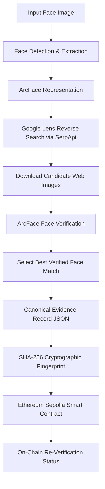

# HH Goa 2026 — Face Identification & Blockchain Verification

An end-to-end pipeline that combines face detection, reverse-image search, ArcFace face verification, canonical SHA-256 hashing, and Ethereum Sepolia blockchain storage to establish tamper-evident cryptographic proofs of visual evidence found across the web.

---

## 📌 Project Overview

The system accepts a user-provided face image, detects and extracts the target face, generates a high-dimensional feature representation using DeepFace and ArcFace, and executes a genuine Google Lens reverse-image search via SerpApi. It downloads top visual candidate images from the web, independently verifies each candidate face against the input image using ArcFace distance scoring, and selects the best verified match. Once a match is confirmed, the system formats a deterministic canonical JSON evidence record, computes a 32-byte SHA-256 cryptographic fingerprint, and records the fingerprint on the **Ethereum Sepolia Testnet** via a custom Solidity smart contract (`VerificationRegistry.sol`). Finally, the pipeline queries the smart contract state to confirm on-chain verification.

> [!IMPORTANT]
> **Terminology & Technical Scope**: This system performs **Face Match Verification** (evaluating visual similarity between image faces under the ArcFace model). It does **not** establish or guarantee a person's legal or real-world identity.

---

## 💡 Problem & Motivation

When digital images or media snippets surface across online platforms, establishing whether a specific face appears elsewhere on the public web—and proving that the resulting evidence has not been modified after the search—presents two distinct challenges:

1. **Visual Match Verification**: Standard reverse-image search identifies visually similar web pages or thumbnail matches, but does not independently verify whether the face within a candidate image matches the query face under a quantitative biometric model.
2. **Evidence Integrity**: Without a tamper-evident audit trail, candidate search results and verification scores can be altered post-analysis without detection.

By linking ArcFace face verification with deterministic canonical JSON hashing and on-chain Ethereum smart contract storage, this system provides a tamper-evident, verifiable record for reverse-image evidence.

---

## 🏗️ System Architecture



### Component Responsibilities:
- **Google Lens Reverse Search**: Discovers candidate web pages and image locations across public indexed media.
- **ArcFace Verification**: Independently calculates cosine distance between the input face and each downloaded candidate face to confirm visual match validity (threshold `< 0.6800`).
- **Ethereum Sepolia Blockchain**: Stores an immutable 32-byte SHA-256 fingerprint of the canonical evidence record, enabling instant on-chain verification and tamper detection.

---

## ✨ Key Features

- **Face Detection & Embedding**: Robust face extraction and 512-D vector representation via `DeepFace` (ArcFace model).
- **Genuine Reverse Image Intelligence**: Live Google Lens API integration via SerpApi (`google_lens` engine).
- **Automated Candidate Verification**: Multi-candidate download, error handling, thumbnail fallback, and ArcFace distance ranking.
- **Canonical Evidence Hashing**: Space-trimmed, key-sorted JSON serialization (`json.dumps(..., sort_keys=True)`) hashed via SHA-256.
- **Ethereum Sepolia Integration**: EIP-1559 transaction submission to custom Solidity smart contract (`VerificationRegistry.sol`, Chain ID `11155111`).
- **On-Chain Integrity Check & Tamper Detection**: Instant verification of recorded fingerprints; modified evidence produces mismatched hashes that fail contract verification.
- **Streamlit Web Dashboard**: Clean, modern light-themed UI (`app.py`) for visual inspection and interactive pipeline execution.
- **Direct Etherscan Proof Links**: Instant navigation to transaction and contract states on Sepolia Etherscan.

---

## 🛠️ Technology Stack

| Component | Technology / Library | Description |
| :--- | :--- | :--- |
| **Language** | Python 3.11 | Primary pipeline execution runtime |
| **Face Recognition** | DeepFace / ArcFace | Face detection & 512-D embedding extraction |
| **Computer Vision** | OpenCV | Image processing & bounding box extraction |
| **Reverse Search** | Google Lens / SerpApi | Public web reverse-image intelligence API |
| **Cryptographic Hashing** | SHA-256 (`hashlib`) | Deterministic evidence fingerprint generation |
| **Smart Contract** | Solidity 0.8.20 | On-chain `VerificationRegistry` contract |
| **Blockchain Client** | Web3.py & `py-solc-x` | Contract compilation, signing & EIP-1559 interaction |
| **Blockchain Network** | Ethereum Sepolia | Public Ethereum testnet (Chain ID `11155111`) |
| **Web Interface** | Streamlit | Optional light SaaS dashboard interface |

---

## 📂 Project Structure

```text
C:\hhgoa-face-blockchain
├── .streamlit/
│   └── config.toml                  # Streamlit light theme configuration
├── blockchain/
│   ├── VerificationRegistry.sol     # Solidity smart contract source
│   ├── blockchain_client.py         # Web3.py client wrapper for Sepolia & local chain
│   ├── contract_sepolia_data.json   # Deployed Sepolia contract address & ABI metadata
│   ├── demo_sepolia.py              # Standalone Sepolia storage & tamper test suite
│   ├── deploy_sepolia.py            # Solidity compiler & Sepolia deployment script
│   └── fingerprint.py               # Canonical JSON hashing & SHA-256 generator
├── search/
│   ├── __init__.py
│   ├── candidate_verifier.py        # Candidate image downloader & ArcFace verifier
│   └── lens_search.py               # SerpApi Google Lens client implementation
├── test_images/
│   ├── person1_a.jpg                # Primary benchmark input test image
│   ├── person1_b.jpg
│   ├── person2.jpg
│   └── person2_a.jpg
├── .env.example                     # Environment variables template (placeholders only)
├── .gitignore                       # Git ignore rules for virtualenvs, keys & outputs
├── app.py                           # Streamlit Web UI presentation dashboard
├── download_test_images.py          # Benchmark image helper download utility
├── download_weights.py             # ArcFace model weights download utility
├── face_processor.py                # DeepFace extraction & ArcFace verification wrapper
├── main.py                          # Main integrated end-to-end CLI pipeline entry point
├── README.md                        # Project documentation
└── requirements.txt                 # Project dependencies list
```

---

## 📥 Installation & Setup

### Windows PowerShell / Command Prompt Setup

1. **Clone Repository & Navigate to Directory**:
   ```cmd
   cd C:\hhgoa-face-blockchain
   ```

2. **Create Python Virtual Environment**:
   ```cmd
   python -m venv .venv
   ```

3. **Activate Virtual Environment**:
   - **PowerShell**:
     ```powershell
     .\.venv\Scripts\Activate.ps1
     ```
   - **Command Prompt**:
     ```cmd
     .venv\Scripts\activate.bat
     ```

4. **Install Required Dependencies**:
   ```cmd
   pip install -r requirements.txt
   ```

---

## ⚙️ Environment Configuration

Create a local `.env` file in the root directory by copying `.env.example`:

```cmd
copy .env.example .env
```

Configure your API keys and Sepolia RPC credentials inside `.env`:

```env
# SerpApi Key for Genuine Google Lens Search
SERPAPI_KEY=your_serpapi_key_here

# Ethereum Sepolia Testnet Credentials
SEPOLIA_RPC_URL=https://eth-sepolia.g.alchemy.com/v2/your_alchemy_key
SEPOLIA_PRIVATE_KEY=your_sepolia_private_key_here
SEPOLIA_CHAIN_ID=11155111
SEPOLIA_CONTRACT_ADDRESS=0x21bD1360C5bc74713EbFf45e83411A63Cde2D03d

# Optional: Local Ganache Fallback
BLOCKCHAIN_RPC_URL=http://127.0.0.1:8545
BLOCKCHAIN_PRIVATE_KEY=
```

> [!CAUTION]
> **Security Notice**: Never commit `.env` or expose private keys or API credentials. `.env` is explicitly ignored in `.gitignore`.

---

## 💻 Running the Integrated CLI Pipeline

The core end-to-end Python pipeline can be executed directly from the terminal:

```cmd
.venv\Scripts\python.exe main.py --image test_images/person1_a.jpg --top 10
```

### What This Command Does:
1. Validates `test_images/person1_a.jpg` and extracts the input face.
2. Queries Google Lens via SerpApi for reverse visual matches.
3. Downloads the top 10 candidate images and evaluates each candidate face against the input face using ArcFace.
4. Ranks candidates and selects the closest verified match (`ArcFace Distance < 0.6800`).
5. Generates the canonical evidence record and SHA-256 fingerprint.
6. Submits an EIP-1559 transaction storing the 32-byte fingerprint on the Ethereum Sepolia smart contract.
7. Re-verifies on-chain state (`verifyRecord` -> `TRUE`) and outputs live Sepolia Etherscan URLs.

---

## 🖥️ Running the Streamlit Dashboard (Optional UI)

To launch the interactive presentation dashboard:

```cmd
.venv\Scripts\python.exe -m streamlit run app.py
```

Open your browser to the local server address:
```text
http://localhost:8501
```

> [!NOTE]
> **Hackathon Requirement Note**: Streamlit is an optional presentation and visual inspection interface built around the core Python pipeline. The underlying pipeline functions independently via `main.py` without requiring Streamlit.

---

## ⛓️ On-Chain Blockchain Proof

The smart contract is deployed and active on the public Ethereum Sepolia Testnet.

- **Network**: Ethereum Sepolia Testnet
- **Chain ID**: `11155111`
- **Smart Contract Address**: [`0x21bD1360C5bc74713EbFf45e83411A63Cde2D03d`](https://sepolia.etherscan.io/address/0x21bD1360C5bc74713EbFf45e83411A63Cde2D03d)
- **Verified Transaction Hash**: [`0x907e7ba43b75ad0fd2b4edd8c9812b186db1d6828c43a85a37e022fcfc92bf80`](https://sepolia.etherscan.io/tx/0x907e7ba43b75ad0fd2b4edd8c9812b186db1d6828c43a85a37e022fcfc92bf80)

> [!IMPORTANT]
> **What the Blockchain Proves**: The blockchain provides an immutable, time-stamped proof that a specific SHA-256 evidence fingerprint was registered by an account. It does **not** independently prove that the underlying web page content is truthful or establish a person's legal identity.

---

## 📊 Example Verified Pipeline Run Output

```text
============================================================
  HH GOA 2026 - FACE VERIFICATION & BLOCKCHAIN PIPELINE   
============================================================

[*] STEP 1: Validating input image and detecting faces...
    - Input Image: test_images/person1_a.jpg
    [+] Face Detection: SUCCESS (1 face(s) detected)

[*] STEP 2: Executing Google Lens reverse image search (SerpApi)...
    [+] Google Lens Search: CONNECTED
    [+] Visual Matches Returned: 59

[*] STEP 3: Downloading top 10 candidates & running ArcFace verification...
    [+] VERIFIED BEST MATCH FOUND:
        - Title         : lena.jpg now : r/programming
        - Source Domain : Reddit
        - Page URL      : https://www.reddit.com/r/programming/comments/dobz8s/lenajpg_now/
        - Image URL     : https://external-preview.redd.it/...
        - ArcFace Dist  : 0.0202 (Threshold: 0.6800)
        - Match Status  : ✓ FACE MATCH VERIFIED

[*] STEP 5: Generating canonical record & SHA-256 fingerprint...
    - Canonical Record : {"face_distance":0.0202,"face_match":true,"image_url":"...","source":"Reddit","source_url":"...","title":"..."}
    - SHA-256 Fingerprint : 6943a03c3a321a645bf367aff9e216c94ded15eff45974b0185e5c54b079b480

[*] STEP 6: Connecting to local blockchain & recording fingerprint...
    [+] Blockchain: CONNECTED (Ethereum Sepolia)
    [+] Contract Address: 0x21bD1360C5bc74713EbFf45e83411A63Cde2D03d
    [+] Transaction Hash : 907e7ba43b75ad0fd2b4edd8c9812b186db1d6828c43a85a37e022fcfc92bf80
    [+] Block Number     : 11641080
    [+] On-Chain Verification Status: True
    [+] FINGERPRINT VERIFIED ON BLOCKCHAIN

============================================================
FINAL RESULT
============================================================
FACE MATCH:       ✓ VERIFIED
BLOCKCHAIN RECORD: ✓ VERIFIED ON-CHAIN
============================================================
```

---

## 🔒 Tamper Detection Demonstration

1. **Original Evidence Verification**:
   - Evidence Payload: Exact match details (Title, Domain, Source URL, Image URL, ArcFace Distance `0.0202`).
   - SHA-256 Hash: `6943a03c3a321a645bf367aff9e216c94ded15eff45974b0185e5c54b079b480`.
   - On-Chain State: `verifyRecord(0x6943a03c...)` -> **`TRUE / VERIFIED`**.

2. **Tampered Evidence Detection**:
   - Altered Payload: Distance modified to `0.5000` or URL character modified.
   - SHA-256 Hash: `3db8c190a13cc0e564f34f62da957ee8290d8e74e995dda5796b1617f68e8f24`.
   - On-Chain State: `verifyRecord(0x3db8c190...)` -> **`FALSE / TAMPER DETECTED`**.

---

## ⚠️ Limitations & Responsible Use

- **Biometric Matching Scope**: Face verification indicates visual similarity under ArcFace embedding distance (`< 0.6800`). It is not legal proof of real-world identity.
- **Search Engine Reliance**: Reverse-image search results depend on publicly indexed web content provided via third-party APIs (SerpApi / Google Lens). Indexed content can change over time.
- **Blockchain Evidence Scope**: On-chain registration proves that an evidence record was generated at a specific point in time and has not been modified since. It does not certify the truthfulness of the underlying web page.
- **Network Scope**: Deployment uses the Ethereum Sepolia Testnet.

---

## 🔮 Future Improvements

- **Multi-Face Batch Indexing**: Extend candidate verification to detect and align multiple target faces simultaneously within single group scenes.
- **Layer-2 Rollup Anchoring**: Support L2 networks (e.g., Arbitrum, Optimism, Base) for lower gas transaction costs.
- **Decentralized Storage (IPFS/Arweave)**: Store full candidate evidence assets on IPFS alongside on-chain hash fingerprints.
